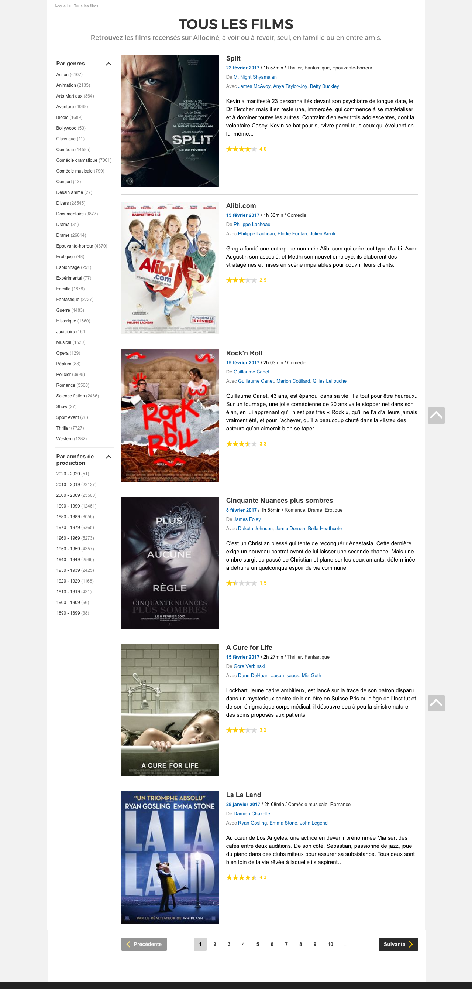
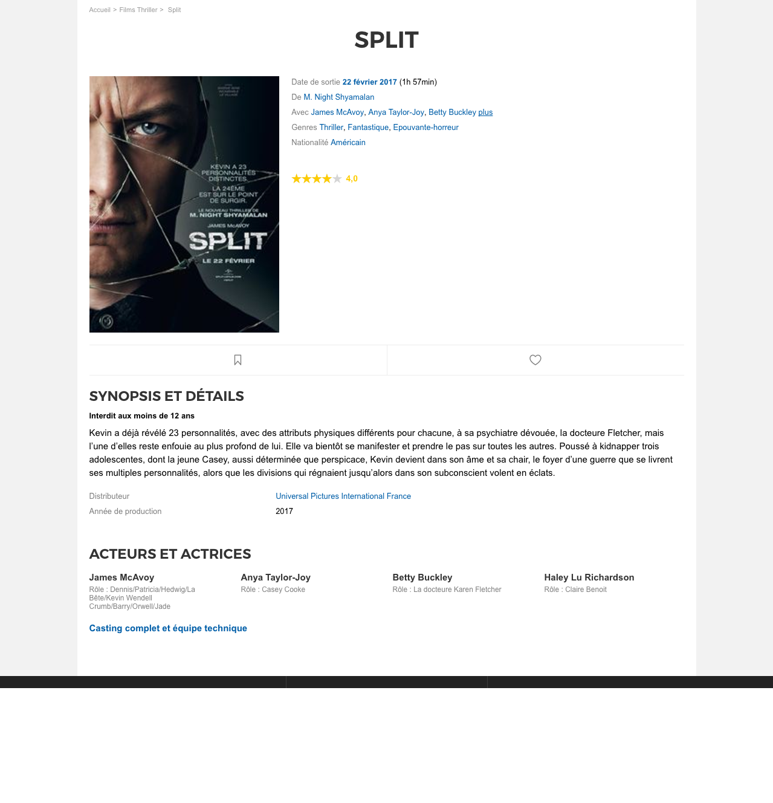

# Challenge MovieDB

## Objectif
S'entraîner à concevoir des schémas.
Le 1er exercice est la préparation de la journée de demain!
Les 2 autres vous permettent de vous entraîner à concevoir des schémas de bases de données.

## Exercices
### Exo 1
- Construire la base de données du projet de la semaine, "Movie DB!(titre provisoire)".
On veut recréer un équivalent (light) de Allociné, qui présente des films, classés par genres, et associés (encore!) à des mots clés (keywords).
Créez le schéma de bases de données correspondant à ces maquettes:

### Exo 2
Une bibliothèque dispose d’une base de données reprenant des ouvrages, respectant les contraintes suivantes :
– Chaque ouvrage est doté d’un numéro l’identifiant au sein de la bibliothèque et est caractérisé par son numéro ISBN, son titre, son éditeur, sa date de parution, ses auteurs (décrits par leurs numéro, nom et prénom) et ses références bibliographiques (les ouvrages qu’il cite).
– Un exemplaire est caractérisé par un numéro qui le distingue des autres exemplaires du même ouvrage, sa date d’acquisition, son état de vétusté.
– La bibliothèque dispose en outre d’un catalogue reprenant des ouvrages (identifiés par un numéro unique et décrits par leur numéro ISBN, leur titre, leur éditeur, leur date de parution et leurs auteurs).
– Un inscrit est caractérisé par un numéro d’inscription, ses nom, prénom et adresse.
– Quand une personne emprunte un ouvrage, on retient la date de début d’un emprunt en cours, ainsi que sa date de retour prévue. Quand l’exemplaire est
restitué, on conserve l’information relative à l’emprunt en y ajoutant la date de restitution.
– On supposera qu’un même exemplaire ne peut être emprunté deux fois le même
jour

### Exo 3
On veut stocker des informations sur des albums de bandes dessinées.
• Un album de bandes dessinées est conçu par une ou plusieurs personnes. Ces personnes
peuvent tenir des rôles différents : dessinateur, scénariste, coloriste. Un album de
BD peut avoir plusieurs scénaristes (ou dessinateurs, ...) et une personne peut avoir
plusieurs rôles dans la conception d’une bande dessinée (être à la fois scénariste et
dessinateur).
• Un album est un ouvrage paru chez un éditeur. Ce point n’étant pas essentiel dans
notre base de donnée, l’éditeur apparaîtra simplement comme un attribut de l’ouvrage,
mais pas comme une entité à part.
• Il est possible qu’un album de BD fasse partie d’une série. Dans ce cas, on voudra
connaître la place qu’occupe cet album dans la série.
• Enfin, une BD est souvent classée dans un genre (par exemple, ”science fiction”, ”humour”,
”historique”)
